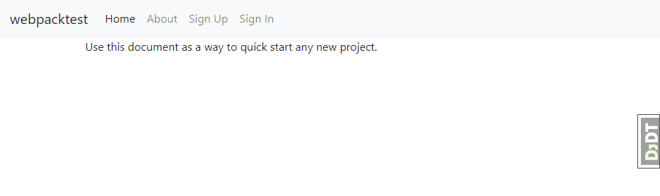

This is how to use [Cookiecutter Django](https://github.com/pydanny/cookiecutter-django/) to create a React SPA. This assumes knowlege of Django and Python. Make sure you've installed [The latest version of Python](https://www.python.org/), [https://www.postgresql.org/](PostgreSQL), [Node.js](https://nodejs.org/en/), [yarn](https://yarnpkg.com/lang/en/docs/getting-started/) and [Ruby](https://www.ruby-lang.org/en/).

Go to some directory where you work on your projects. I typically do my work inside `Documents/dev`. Run `cookiecutter https://github.com/pydanny/cookiecutter-django project_name=webpacktest windows=y debug=y` and make sure you select [2] for gulp when it asks you about the "js task runner". This will make a directory called `webpacktest`. `cd` into this directory and follow the following two tutorials:

[http://cookiecutter-django.readthedocs.io/en/latest/developing-locally.html](Setting Up Development Environment)

[https://cookiecutter-django.readthedocs.io/en/latest/live-reloading-and-sass-compilation.html](Sass Compilation & Live Reloading)

When you run `npm run dev`, it runs `npm gulp` (which it knows to run by reading the `"dev": "gulp"` line in `package.json`) opens a new tab at `http://localhost:3000/`. If it opens a tab but nothing shows up, try reloading. You should see something like this:

 

If you go into `webpacktest/webpacktest/templates/base.html`, you can make changes and save it and it should update the page without you having to reload. Gulp is reading from `gulpfile.js`, what we need to do now is write a Webpack configuration file that will do something similar to what this `gulpfile.js` does. But first, lets rearrange this project structure to be a little more sane. Lets take a look at `\webpacktest\webpacktest\static`.

    webpacktest  
    └───webpacktest  
        └───static  
            ├───css  
            ├───fonts  
            ├───images  
            │   └───favicons  
            ├───js  
            └───sass  

To start working in React, we don't need any of this, but we can leave it here. Lets make a new folder inside `webpacktest/webpacktest` called `src`. This is where we'll do our development. Files in `src` will automatically be compiled and copied into `static`. 

    webpacktest
    └───webpacktest
        ├───src  
        └───static  
            ├───css  
            ├───fonts  
            ├───images  
            │   └───favicons  
            ├───js  
            └───sass  

Now lets put some content inside `src` real quickly. Make a new file, `src/index.jsx`. We need to put a basic react app in here. If you don't know what to put, here's something that'll just render "Hello world!".

    import { render } from 'react-dom';

    render(<h1>Hello world! {window.props.a[0]} </h1>, document.getElementById('root'));

Now, we're going to use Mozilla's excellent [NeutrinoJS](https://neutrinojs.org/) to build our project. Run 

    yarn add @neutrinojs/react @neutrinojs/airbnb-base @neutrinojs/pwa neutrino-middleware-browser-sync neutrino-preset-flow react react-dom @neutrinojs/eslint webpack@3.0.0 --save
    yarn add browser-sync neutrino webpack-cli webpack-dev-server --dev

Now lets go into our `webpacktest/package.json` and edit it to work with our react scripts. Replace

    "scripts": {
        "dev": "gulp"
    }

with

    "scripts": {
        "start": "neutrino start",
        "build": "neutrino build"
    }

Lastly, create a `webpacktest/.neutrinorc.js`. This will be our configuration file for Neutrino. The contents of this file should look something like this:

    module.exports = {
    options: {
        root: 'webpacktest',
        source: 'src',
        output: 'static',
    },
    use: [
        // '@neutrinojs/pwa', // Uncomment to enable PWA (this is mostly used in production)
        '@neutrinojs/airbnb-base',
        '@neutrinojs/react',
        {
        html: {
            title: 'react-files'
        }
        },
        (neutrino) => {
        if (neutrino.options.command === 'start') {
            neutrino.config.devServer.clear();
        }
        },
    'neutrino-middleware-browser-sync', {
        browserSyncOptions: {
            port: 6000
        },
        pluginOptions: {
            reload: false
        }
        } /**/

    ]/*
    use: [
        '@neutrinojs/airbnb',
        [
        '@neutrinojs/react',
        {
            html: {
            title: 'react-files'
            }
        },
        (neutrino) => {
            if (neutrino.options.command === 'start') {
            neutrino.config.devServer.clear();
            }
        }
        ],
        '@neutrinojs/jest' @neutrinojs/react 
    ]*/
    };

If you wanted to use a different django app, not the default one, you would replace `webpacktest` in `root: 'webpacktest'` with the name of your app.

Now if you open two command prompts at `webpacktest`, you should be able to run `yarn start` in one and `python manage.py runserver` in another. You'll notice that any changes you make to `webpacktest/webpacktest/src/index.jsx` are copied into `webpacktest/webpacktest/static/index.js` (after compiling it to javascript from jsx). So now we have that, the last part of the job is to actually view it in django. Make a new template at `webpacktest/webpacktest/templates/homepage.html` and put this inside:

    <!DOCTYPE html>
    <html lang="en">
    <head>
    <meta charset="utf-8">
    <meta content="ie=edge" http-equiv="x-ua-compatible">
    <title>Webpack App</title>
    <meta content="width=device-width,initial-scale=1" name="viewport">
    </head>
    <body>
    

    

    
    
    
    
    
    </body>
    </html>

Now, make a new view in `webpacktest/webpacktest/users/views.py` that looks something like this:

    import json

    [...]

    def index(request):

        props = {"a": ["1", "@", "3"]}

        context = {'image_collection_list': image_collection_list,
                'project_list': project_list,
                "props": json.dumps(props)}

        return render(request, 'homepage.html', context)

Now, go to your `webpacktest/webpacktest/users/urls.py` and change 

    path("", view=views.UserListView.as_view(), name="list"),

to 

    path("", view=views.index, name="index"),

Now when you go to `localhost:8000` you should see a page with your shiny new react app, saying "Hello world! @`
